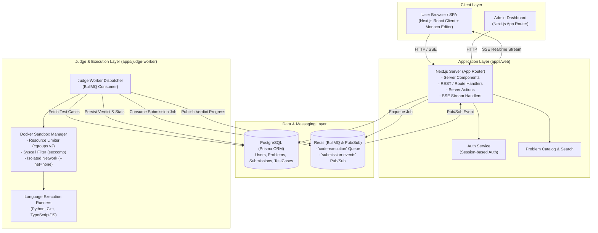
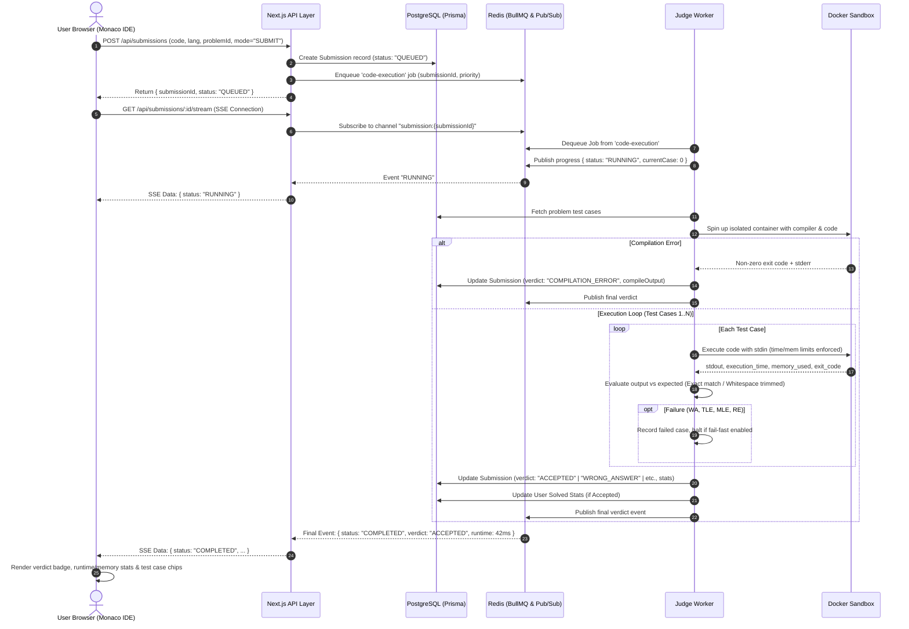
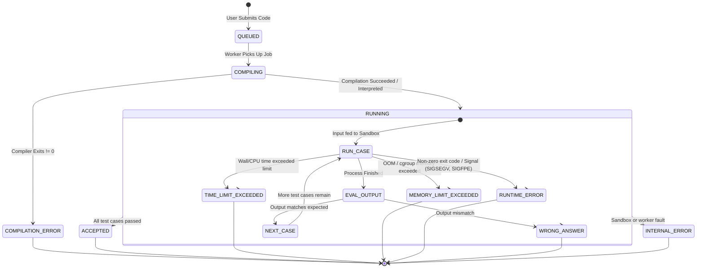

# CodeArena System Architecture

This document specifies the technical architecture for **CodeArena**, a production-grade online judge and competitive programming platform.

---

## 1. High-Level System Architecture

CodeArena uses a decoupled, asynchronous, event-driven architecture designed to separate interactive web traffic from CPU/memory-intensive, untrusted code execution.



> **Note on Architecture Evolution:** Infrastructure components like Edge WAF/CDNs (Cloudflare), Ingress Proxies (Nginx), S3/MinIO Object Storage for massive test cases, and AI Assistant integrations are part of the target production architecture but are **explicitly excluded from the MVP baseline** to maintain focus on the core vertical slice.

---

## 2. Monorepo Repository Structure

CodeArena is organized as a modular monorepo managed with **Turborepo** and **pnpm workspaces**.

```
codearena/
├── .github/
│   └── workflows/
│       ├── ci.yml                 # Lint, Typecheck, Test
│       └── deploy.yml             # Build & Deploy verification
├── apps/
│   ├── web/                       # Next.js (App Router) frontend & API backend
│   │   ├── app/
│   │   │   ├── (auth)/            # Login, Register
│   │   │   ├── (dashboard)/       # User profile, Submissions
│   │   │   ├── (platform)/
│   │   │   │   ├── problems/      # Problem list, search, tags
│   │   │   │   └── problems/[slug]/ # Problem view & Monaco IDE split-view
│   │   │   ├── admin/             # Basic problem & test case management
│   │   │   └── api/
│   │   │       ├── auth/          # Authentication handlers
│   │   │       ├── submissions/   # Run, Submit, History, SSE stream
│   │   │       └── problems/      # Problem CRUD & search
│   │   ├── components/            # UI components (Monaco editor, Test panel)
│   │   ├── hooks/                 # Custom React hooks (useSubmission, useSSE)
│   │   ├── lib/                   # API clients, auth session helpers, db instance
│   │   └── styles/                # Tailwind CSS configs and global styles
│   │
│   └── judge-worker/              # Asynchronous execution worker (Node.js/TypeScript)
│       ├── src/
│       │   ├── consumers/         # BullMQ queue consumer
│       │   ├── engines/           # Execution orchestrator per language
│       │   ├── sandbox/           # Docker runner wrapper (cgroups & seccomp)
│       │   ├── evaluators/        # Exact match and whitespace normalization
│       │   └── index.ts           # Worker bootstrap
│       ├── Dockerfile             # Multi-stage worker image
│       └── sandboxes/             # Language runner Dockerfiles
│           ├── cpp/
│           ├── python/
│           └── typescript/
│
├── packages/
│   ├── db/                        # Prisma schema, migrations, and client singleton
│   │   ├── prisma/
│   │   │   └── schema.prisma
│   │   └── src/index.ts
│   │
│   ├── judge-shared/              # Shared types, judge status enums, execution DTOs
│   │   ├── src/
│   │   │   ├── types.ts           # SubmissionJob, ExecutionResult, Verdict
│   │   │   ├── constants.ts       # Time limits, Memory bounds
│   │   │   └── languages.ts       # Supported language metadata
│   │   └── package.json
│   │
│   ├── ui/                        # Shared UI primitives
│   ├── tsconfig/                  # Shared TypeScript configuration
│   └── eslint-config/             # Shared ESLint rules
│
├── docs/                          # Architectural, Database, Security, & Roadmap docs
│   ├── ARCHITECTURE.md
│   ├── DATABASE.md
│   ├── SECURITY.md
│   ├── ROADMAP.md
│   └── MVP_SPEC.md
│
├── docker-compose.yml             # Local full-stack environment (Postgres, Redis, Worker)
├── turbo.json                     # Turborepo task pipeline
├── pnpm-workspace.yaml
└── package.json
```

---

## 3. Technology Choices & Trade-off Analysis

| Area                     | Chosen Technology                            | Alternatives Considered        | Trade-off Rationale                                                                                                                                                                                                             |
| :----------------------- | :------------------------------------------- | :----------------------------- | :------------------------------------------------------------------------------------------------------------------------------------------------------------------------------------------------------------------------------ |
| **Monorepo Management**  | **Turborepo + pnpm**                         | Nx, Polyrepo                   | Turborepo provides fast zero-config caching and lightweight configuration. pnpm saves disk space and strictly isolates dependencies. Shared types between `web` and `judge-worker` prevent API drift.                           |
| **Full-Stack Framework** | **Next.js (Current Stable App Router)**      | Vite SPA + Express API         | App Router gives hybrid Server Components for fast SEO problem rendering and Server Actions for low-boilerplate mutations, combined with Route Handlers for SSE streaming.                                                      |
| **Styling**              | **Tailwind CSS**                             | CSS Modules, styled-components | Rapid UI development, zero runtime overhead, excellent dark-mode support, and consistent token-driven design system.                                                                                                            |
| **Code Editor**          | **Monaco Editor**                            | CodeMirror, Ace                | Monaco powers VS Code, offering first-class syntax highlighting, keyboard shortcuts, and code editing for competitive programmers.                                                                                              |
| **Database & ORM**       | **PostgreSQL + Prisma**                      | Drizzle, TypeORM, MongoDB      | PostgreSQL offers rock-solid ACID transactions, relational integrity, and composite indices. Prisma provides type-safe query generation and migration tracking.                                                                 |
| **Queue & Messaging**    | **Redis + BullMQ**                           | RabbitMQ, Kafka, SQS           | Redis serves as both a low-latency cache and the backing store for BullMQ. BullMQ supports priority queues (run vs submit), retries, and events with minimal operational complexity.                                            |
| **Live Updates**         | **Server-Sent Events (SSE) + Redis Pub/Sub** | WebSockets, Polling            | SSE is unidirectional, lightweight, works seamlessly over HTTP, traverses corporate proxies, and requires no custom WebSocket connection handshake.                                                                             |
| **Code Sandboxing**      | **Docker with cgroups v2 + seccomp + tmpfs** | Firecracker, bare nsjail       | Docker with hardened non-root profiles, zero network (`--net none`), read-only root, memory/CPU cgroups, and seccomp syscall filtering offers the optimal balance between security, language versatility, and setup simplicity. |

---

## 4. Asynchronous Code Execution Flow

The code execution pipeline separates **Run Code** (testing against public sample cases / custom input) and **Submit Code** (grading against hidden test suites).



---

## 5. Online Judge Verdict State Machine

The online judge categorizes execution outputs into deterministic verdicts:



---

## 6. Supported Programming Languages

### MVP Languages:

1. **Python**: 3.12 (CPython)
2. **C++**: C++20 (GCC)
3. **TypeScript / JavaScript**: Node.js 20

### Language Specifications:

| Language          | Environment | Execution Command                                           | Default Time Limit | Default Memory Limit |
| :---------------- | :---------- | :---------------------------------------------------------- | :----------------- | :------------------- |
| **Python**        | Python 3.12 | `python3 solution.py`                                       | 2000 ms            | 256 MB               |
| **C++**           | GCC (C++20) | `g++ -O3 -std=c++20 solution.cpp -o solution && ./solution` | 1000 ms            | 256 MB               |
| **TypeScript/JS** | Node.js 20  | `node solution.js`                                          | 2000 ms            | 256 MB               |

_(Java, Rust, and Go are planned for Post-MVP)._
