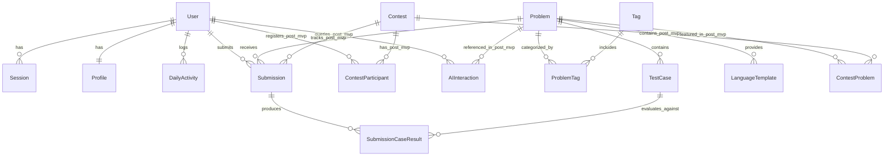

# CodeArena Database Entity Model & Schema Design

This document details the PostgreSQL schema, entity relationships, indexing strategies, and caching architecture for **CodeArena** using **Prisma ORM**.

---

## 1. Entity-Relationship Diagram



---

## 2. Complete Prisma Schema (`packages/db/prisma/schema.prisma`)

```prisma
datasource db {
  provider = "postgresql"
  url      = env("DATABASE_URL")
}

generator client {
  provider = "prisma-client-js"
}

// --------------------------------------------------------
// ENUMS
// --------------------------------------------------------

enum Role {
  USER
  MODERATOR
  ADMIN
}

enum Difficulty {
  EASY
  MEDIUM
  HARD
}

enum Language {
  PYTHON
  CPP
  TYPESCRIPT
  JAVASCRIPT
  // Post-MVP Languages:
  JAVA
  RUST
  GO
}

enum SubmissionStatus {
  QUEUED
  RUNNING
  COMPLETED
}

enum Verdict {
  ACCEPTED
  WRONG_ANSWER
  TIME_LIMIT_EXCEEDED
  MEMORY_LIMIT_EXCEEDED
  COMPILATION_ERROR
  RUNTIME_ERROR
  INTERNAL_ERROR
}

enum ContestStatus {
  UPCOMING
  RUNNING
  FINISHED
}

enum AIInteractionType {
  HINT_LEVEL_1
  HINT_LEVEL_2
  HINT_LEVEL_3
  CODE_EXPLANATION
  COMPLEXITY_ANALYSIS
}

// ========================================================
// MVP CORE MODELS
// ========================================================

// --------------------------------------------------------
// USER & AUTHENTICATION
// --------------------------------------------------------

model User {
  id            String    @id @default(cuid())
  email         String    @unique
  username      String    @unique
  passwordHash  String
  role          Role      @default(USER)
  isEmailVerified Boolean @default(false)

  createdAt     DateTime  @default(now())
  updatedAt     DateTime  @updatedAt

  sessions      Session[]
  profile       Profile?
  submissions   Submission[]
  activities    DailyActivity[]

  // Relations for Post-MVP features (Schema-ready, logic deferred)
  contestEntries ContestParticipant[]
  aiInteractions AIInteraction[]

  @@index([email])
  @@index([username])
}

model Session {
  id           String   @id @default(cuid())
  sessionToken String   @unique
  userId       String
  expires      DateTime
  ipAddress    String?
  userAgent    String?
  createdAt    DateTime @default(now())

  user         User     @relation(fields: [userId], references: [id], onDelete: Cascade)

  @@index([userId])
  @@index([sessionToken])
}

// --------------------------------------------------------
// USER PROFILE & STATISTICS
// --------------------------------------------------------

model Profile {
  id               String   @id @default(cuid())
  userId           String   @unique
  avatarUrl        String?
  bio              String?  @db.VarChar(500)
  githubUrl        String?
  linkedinUrl      String?

  // Rating & Derived stats (globalRank is computed/cached, not authoritative)
  rating           Int      @default(1200)
  globalRank       Int?     // Derived / cached snapshot

  // Solved Stats
  totalSolved      Int      @default(0)
  easySolved       Int      @default(0)
  mediumSolved     Int      @default(0)
  hardSolved       Int      @default(0)
  totalSubmissions Int      @default(0)

  // Streak Management
  currentStreak    Int      @default(0)
  maxStreak        Int      @default(0)
  lastActiveAt     DateTime?

  user             User     @relation(fields: [userId], references: [id], onDelete: Cascade)

  @@index([rating(sort: Desc)])
  @@index([totalSolved(sort: Desc)])
}

model DailyActivity {
  id              String   @id @default(cuid())
  userId          String
  date            DateTime @db.Date // YYYY-MM-DD
  submissionCount Int      @default(0)
  solvedCount     Int      @default(0)

  user            User     @relation(fields: [userId], references: [id], onDelete: Cascade)

  @@unique([userId, date])
  @@index([userId, date(sort: Desc)])
}

// --------------------------------------------------------
// PROBLEMS & METADATA
// --------------------------------------------------------

model Problem {
  id             String       @id @default(cuid())
  slug           String       @unique
  title          String
  difficulty     Difficulty   @default(EASY)
  statement      String       @db.Text
  inputFormat    String       @db.Text
  outputFormat   String       @db.Text
  constraints    String       @db.Text

  // Default limits
  timeLimitMs    Int          @default(1000) // Default 1 second
  memoryLimitMb  Int          @default(256)  // Default 256 MB

  // Editorial and Hints
  editorial      String?      @db.Text
  hints          String[]     @default([])

  // Aggregate Stats
  totalAccepted  Int          @default(0)
  totalSubmissions Int        @default(0)
  acceptanceRate Float        @default(0.0)

  isPublished    Boolean      @default(false)
  createdAt      DateTime     @default(now())
  updatedAt      DateTime     @updatedAt

  tags           ProblemTag[]
  testCases      TestCase[]
  templates      LanguageTemplate[]
  submissions    Submission[]

  // Post-MVP relations
  contestProblems ContestProblem[]
  aiInteractions AIInteraction[]

  @@index([difficulty])
  @@index([isPublished])
  @@index([slug])
}

model Tag {
  id          String       @id @default(cuid())
  name        String       @unique
  slug        String       @unique
  problems    ProblemTag[]

  @@index([slug])
}

model ProblemTag {
  problemId   String
  tagId       String

  problem     Problem      @relation(fields: [problemId], references: [id], onDelete: Cascade)
  tag         Tag          @relation(fields: [tagId], references: [id], onDelete: Cascade)

  @@id([problemId, tagId])
  @@index([tagId])
  @@index([problemId])
}

model TestCase {
  id             String   @id @default(cuid())
  problemId      String
  inputData      String   @db.Text
  expectedOutput String   @db.Text

  isSample       Boolean  @default(false)
  isHidden       Boolean  @default(true)
  orderIndex     Int      @default(0)
  explanation    String?  @db.Text

  problem        Problem  @relation(fields: [problemId], references: [id], onDelete: Cascade)
  caseResults    SubmissionCaseResult[]

  @@index([problemId, isSample])
  @@index([problemId, orderIndex])
}

model LanguageTemplate {
  id             String   @id @default(cuid())
  problemId      String
  language       Language
  boilerPlate    String   @db.Text // Initial code presented to user
  driverCode     String?  @db.Text // Optional wrapper / main function

  problem        Problem  @relation(fields: [problemId], references: [id], onDelete: Cascade)

  @@unique([problemId, language])
}

// --------------------------------------------------------
// SUBMISSIONS & VERDICTS
// --------------------------------------------------------

model Submission {
  id             String           @id @default(cuid())
  userId         String
  problemId      String
  contestId      String?          // Null for regular practice submissions
  language       Language
  code           String           @db.Text

  status         SubmissionStatus @default(QUEUED)
  verdict        Verdict?

  executionTimeMs Int?            // Max execution time across cases
  memoryUsedKb   Int?             // Peak memory consumed
  passedCases    Int              @default(0)
  totalCases     Int              @default(0)

  compileOutput  String?          @db.Text
  errorMessage   String?          @db.Text

  createdAt      DateTime         @default(now())

  user           User             @relation(fields: [userId], references: [id], onDelete: Cascade)
  problem        Problem          @relation(fields: [problemId], references: [id], onDelete: Cascade)
  contest        Contest?         @relation(fields: [contestId], references: [id], onDelete: SetNull)
  caseResults    SubmissionCaseResult[]

  @@index([userId, createdAt(sort: Desc)])
  @@index([problemId, verdict])
  @@index([status])
  @@index([contestId])
}

model SubmissionCaseResult {
  id              String     @id @default(cuid())
  submissionId    String
  testCaseId      String
  status          Verdict
  executionTimeMs Int
  memoryUsedKb    Int

  stdout          String?    @db.Text
  stderr          String?    @db.Text
  actualOutput    String?    @db.Text // Only stored/revealed for sample test cases

  submission      Submission @relation(fields: [submissionId], references: [id], onDelete: Cascade)
  testCase        TestCase   @relation(fields: [testCaseId], references: [id], onDelete: Cascade)

  @@index([submissionId])
}

// ========================================================
// POST-MVP ENTITIES (Schema defined for future compatibility;
// logic, APIs, and UI explicitly deferred)
// ========================================================

model Contest {
  id          String             @id @default(cuid())
  slug        String             @unique
  title       String
  description String             @db.Text
  startTime   DateTime
  endTime     DateTime
  status      ContestStatus      @default(UPCOMING)
  isPublished Boolean            @default(false)
  createdAt   DateTime           @default(now())

  problems    ContestProblem[]
  participants ContestParticipant[]
  submissions Submission[]

  @@index([status, startTime])
  @@index([slug])
}

model ContestProblem {
  contestId   String
  problemId   String
  orderIndex  Int                @default(0)
  points      Int                @default(100)

  contest     Contest            @relation(fields: [contestId], references: [id], onDelete: Cascade)
  problem     Problem            @relation(fields: [problemId], references: [id], onDelete: Cascade)

  @@id([contestId, problemId])
  @@index([contestId, orderIndex])
}

model ContestParticipant {
  contestId       String
  userId          String
  score           Int            @default(0)
  penaltyTimeMins Int            @default(0)
  rank            Int?
  registeredAt    DateTime       @default(now())

  contest         Contest        @relation(fields: [contestId], references: [id], onDelete: Cascade)
  user            User           @relation(fields: [userId], references: [id], onDelete: Cascade)

  @@id([contestId, userId])
  @@index([contestId, score(sort: Desc), penaltyTimeMins(sort: Asc)])
}

model AIInteraction {
  id               String            @id @default(cuid())
  userId           String
  problemId        String
  interactionType  AIInteractionType
  promptTokens     Int               @default(0)
  completionTokens Int               @default(0)
  prompt           String            @db.Text
  response         String            @db.Text
  createdAt        DateTime          @default(now())

  user             User              @relation(fields: [userId], references: [id], onDelete: Cascade)
  problem          Problem           @relation(fields: [problemId], references: [id], onDelete: Cascade)

  @@index([userId, createdAt(sort: Desc)])
  @@index([problemId])
}
```

---

## 3. Database Indexing & Query Patterns

1. **Submission History**:
   - Compound index `Submission(userId, createdAt DESC)` powers paginated submission feeds.
2. **Problem Filtering**:
   - Index `Problem(difficulty, isPublished)` with `ProblemTag(tagId)` provides fast problem search and tag filtering.
3. **Rankings & Stats**:
   - `Profile.globalRank` is treated as a snapshot / derived metric computed by background tasks or queries, keeping `Profile.rating` and `Profile.totalSolved` as the primary sorted attributes.
