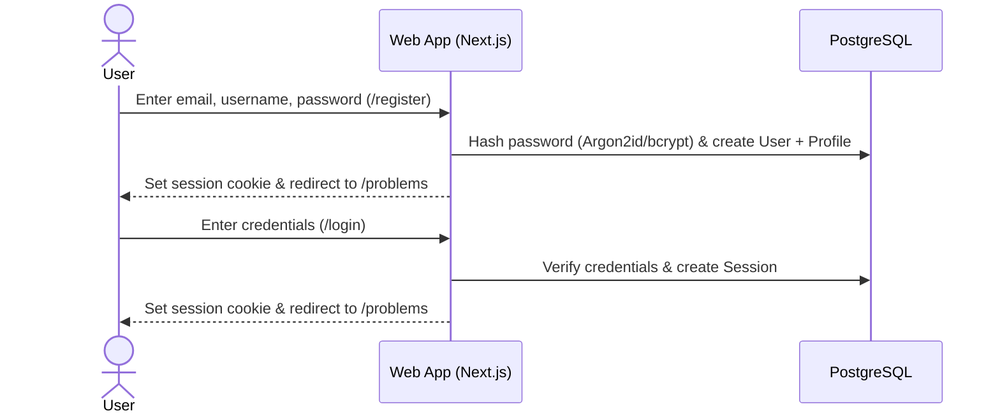
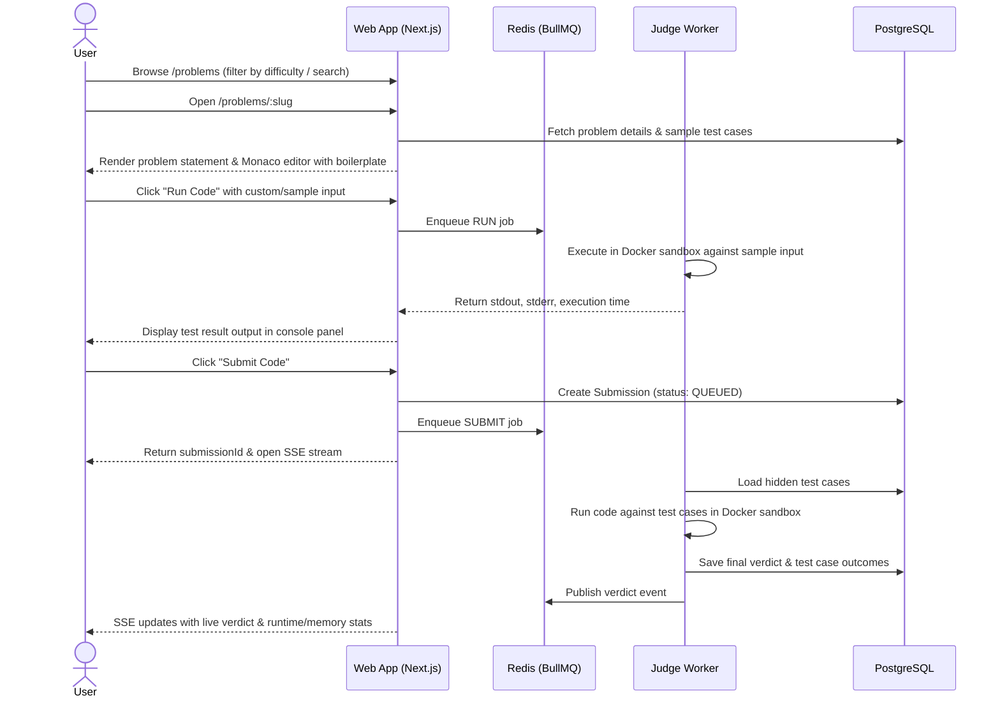
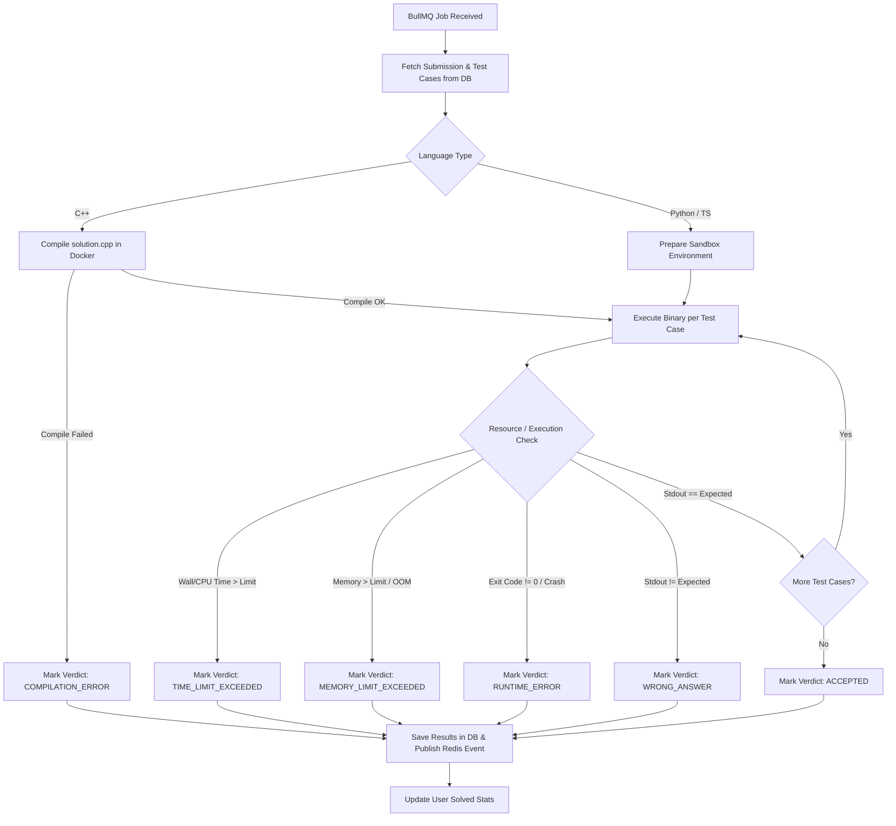

# CodeArena MVP Specification

This document defines the exact scope, user flows, interfaces, APIs, judge workflow, development order, and Definition of Done for the **CodeArena MVP (Phase 1)**.

---

## 1. MVP Goals

The primary goal of the CodeArena MVP is to deliver a rock-solid, production-grade **vertical slice** of an online judge:

1. Allow users to register, log in, and view their profile.
2. Allow users to browse and filter programming problems by difficulty and tag.
3. Provide a Monaco-powered IDE where users can write, run (against sample inputs), and submit code in Python, C++, and TypeScript.
4. Safely execute submitted code in an isolated Docker sandbox managed via a BullMQ background queue.
5. Provide real-time judge verdicts and maintain complete submission history.
6. Provide an administrative interface to create problems and manage test cases.

---

## 2. Feature Boundaries

### 2.1 Explicitly Included Features

- **User Authentication**: Email/Password registration, login, logout, and secure session management.
- **Problem Catalog**: Paginated problem list with difficulty badges (Easy, Medium, Hard), tag filters, and search.
- **Problem Detail Workspace**:
  - Split-pane layout (problem statement, constraints, examples on the left; Monaco editor on the right).
  - Language selector (Python 3.12, C++20, TypeScript/JS).
  - Boilerplate code templates per language.
  - Custom input test runner ("Run Code").
  - Official submission evaluator ("Submit Code").
- **Execution & Judge Engine**:
  - Redis + BullMQ asynchronous job queue.
  - Docker sandbox runner enforcing memory, CPU, and zero-network boundaries.
  - Real-time verdict streaming via Server-Sent Events (SSE).
  - Deterministic verdicts: `ACCEPTED`, `WRONG_ANSWER`, `TIME_LIMIT_EXCEEDED`, `MEMORY_LIMIT_EXCEEDED`, `COMPILATION_ERROR`, `RUNTIME_ERROR`, `INTERNAL_ERROR`.
- **Submission History**:
  - User submission log per problem and overall history with runtime, memory, and code viewer.
- **Admin Management**:
  - Admin problem creation form (Markdown editor, limits, constraints).
  - Test case management (add sample and hidden test cases).

### 2.2 Explicitly Excluded Features (Deferred to Post-MVP)

- ❌ Contests, competition lobbies, and live ICPC scoreboards
- ❌ Gemini AI hints, explanations, and complexity analysis
- ❌ S3 / MinIO external storage (test cases stored directly in PostgreSQL for MVP)
- ❌ Pre-warmed container pools & multi-region worker clusters
- ❌ Cloudflare WAF, Nginx reverse proxy, and custom ingress rules
- ❌ Prometheus, Grafana, and advanced telemetry
- ❌ Additional languages (Java, Rust, Go)
- ❌ Social features (comments, discussions, direct messaging)

---

## 3. User Flows

### 3.1 Authentication Flow

### 3.2 Problem Exploration & Solving Flow

---

## 4. Required Pages & UI Views

| Route                             | Name                    | Purpose & Components                                                                                                                                                                                               |
| :-------------------------------- | :---------------------- | :----------------------------------------------------------------------------------------------------------------------------------------------------------------------------------------------------------------- |
| `/`                               | Landing / Redirect      | Redirects to `/problems` or showcases platform overview.                                                                                                                                                           |
| `/register`                       | Registration            | Form with validation (email, username, password) and redirect.                                                                                                                                                     |
| `/login`                          | Login                   | Form with credential authentication and session establishment.                                                                                                                                                     |
| `/problems`                       | Problem Catalog         | Search bar, difficulty filters (Easy/Medium/Hard), tag chips, paginated problem table with solved indicators.                                                                                                      |
| `/problems/[slug]`                | Problem Workspace       | Split view: Left pane with Problem description, constraints, and examples; Right pane with Monaco editor, language selector, console input/output panel, "Run" and "Submit" buttons, and submission status drawer. |
| `/submissions`                    | Submission History      | Paginated list of user's past submissions with verdict badges, problem links, languages, runtime, memory, and submission timestamp.                                                                                |
| `/submissions/[id]`               | Submission Detail       | Full submission view showing source code, compile errors (if any), execution stats, and test case breakdown.                                                                                                       |
| `/admin/problems`                 | Admin Problem List      | Table of all problems with edit, test case count, and status toggles.                                                                                                                                              |
| `/admin/problems/new`             | Admin Problem Editor    | Form to create problems (Markdown statement, constraints, time/memory limits, tags).                                                                                                                               |
| `/admin/problems/[id]/test-cases` | Admin Test Case Manager | Form to add, view, and delete sample and hidden test cases.                                                                                                                                                        |

---

## 5. Required API Endpoints

### 5.1 Auth APIs

- `POST /api/auth/register` — Create user and initialize profile.
- `POST /api/auth/login` — Validate credentials, issue session cookie.
- `POST /api/auth/logout` — Invalidate session.
- `GET  /api/auth/me` — Return current authenticated user and profile summary.

### 5.2 Problem APIs

- `GET  /api/problems` — Filterable, paginated problem list.
- `GET  /api/problems/:slug` — Problem statement, metadata, boilerplates, and sample cases (hidden cases excluded).
- `GET  /api/problems/tags` — All available problem category tags.

### 5.3 Execution & Submission APIs

- `POST /api/submissions/run` — Run code against sample/custom input and return immediate test result.
- `POST /api/submissions` — Submit code for official grading against all hidden test cases.
- `GET  /api/submissions/:id` — Fetch submission status, verdict, and statistics.
- `GET  /api/submissions/:id/stream` — SSE endpoint for real-time progress and final verdict updates.
- `GET  /api/submissions` — Fetch paginated submission history for current user.

### 5.4 Admin APIs (Protected by `role === ADMIN`)

- `POST   /api/admin/problems` — Create a new problem.
- `PUT    /api/admin/problems/:id` — Update problem metadata and statements.
- `GET    /api/admin/problems/:id/test-cases` — List all test cases (including hidden).
- `POST   /api/admin/problems/:id/test-cases` — Create a new test case.
- `DELETE /api/admin/problems/:id/test-cases/:caseId` — Remove a test case.

---

## 6. Required Database Entities (MVP Baseline)

1. **`User`**: `id`, `email`, `username`, `passwordHash`, `role`, `createdAt`.
2. **`Session`**: `id`, `sessionToken`, `userId`, `expires`, `createdAt`.
3. **`Profile`**: `id`, `userId`, `totalSolved`, `easySolved`, `mediumSolved`, `hardSolved`, `totalSubmissions`, `rating`.
4. **`Problem`**: `id`, `slug`, `title`, `difficulty`, `statement`, `inputFormat`, `outputFormat`, `constraints`, `timeLimitMs`, `memoryLimitMb`, `isPublished`.
5. **`Tag` & `ProblemTag`**: Category taxonomy (e.g., `Arrays`, `Two Pointers`, `Dynamic Programming`).
6. **`TestCase`**: `id`, `problemId`, `inputData`, `expectedOutput`, `isSample`, `isHidden`, `orderIndex`, `explanation`.
7. **`LanguageTemplate`**: `id`, `problemId`, `language`, `boilerPlate`, `driverCode`.
8. **`Submission`**: `id`, `userId`, `problemId`, `language`, `code`, `status`, `verdict`, `executionTimeMs`, `memoryUsedKb`, `passedCases`, `totalCases`, `compileOutput`, `errorMessage`, `createdAt`.
9. **`SubmissionCaseResult`**: `id`, `submissionId`, `testCaseId`, `status`, `executionTimeMs`, `memoryUsedKb`, `stdout`, `stderr`, `actualOutput`.

---

## 7. Judge Execution Workflow

---

## 8. Development Order

1. **Step 1: Monorepo Setup & Packages**
   - Initialize Turborepo with `pnpm` workspaces (`apps/web`, `apps/judge-worker`, `packages/db`, `packages/judge-shared`, `packages/ui`).
   - Setup `docker-compose.yml` (PostgreSQL 16, Redis 7).
   - Configure Prisma schema and run initial migration.
2. **Step 2: Authentication & Layout Shell**
   - Implement user registration, login, session cookies, and auth middleware.
   - Build navigation bar, layout, and theme foundation (Tailwind CSS).
3. **Step 3: Problem Catalog & Admin Management**
   - Build Problem list with filtering and search.
   - Build Admin problem creator and test case manager.
   - Seed database with starter problems (e.g., Two Sum, Reverse String, Valid Palindrome).
4. **Step 4: Problem Solver Page & Monaco IDE**
   - Build split-pane interface with statement display and Monaco Editor.
   - Language selector with boilerplate code loading.
   - Console panel for custom input / output.
5. **Step 5: Judge Worker & Docker Sandboxing**
   - Create `apps/judge-worker` BullMQ consumer.
   - Build language execution engines for Python, C++, and TypeScript.
   - Implement Docker runner with cgroups v2 limits (`cpu.max`, `memory.max=256M`, `pids.max=64`, `--net=none`, tmpfs).
6. **Step 6: Real-Time Verdict & Submission History**
   - Implement Server-Sent Events (SSE) route in Next.js.
   - Wire up live test case progression and final verdict display in Monaco workspace.
   - Build submission history page and submission detail viewer.

---

## 9. Definition of Done (DoD)

The MVP is considered complete and production-ready when:

1. A new user can register, log in, and persist their session across refreshes.
2. Users can browse, search, and filter problems by difficulty.
3. Users can write a solution in Python, C++, or TypeScript in Monaco Editor.
4. Clicking "Run Code" executes against sample/custom input in under 2 seconds and displays stdout/errors.
5. Clicking "Submit Code" enqueues the job, runs all test cases inside the Docker sandbox, and returns real-time progress followed by the correct verdict (`ACCEPTED`, `WRONG_ANSWER`, `TLE`, `MLE`, `CE`, `RE`).
6. Submitting a correct solution updates the user's solved problem count and records a new submission entry.
7. An admin can create a new problem with Markdown statements and upload sample/hidden test cases via the admin UI.
8. Malicious code (fork bombs, infinite loops, network calls) is safely neutralized by the judge sandbox without host degradation.

---

## 10. Testing Requirements

- **Unit Tests**: Test case output evaluators (whitespace trimming, exact matching) and language execution command builders.
- **Integration Tests**: Auth endpoints, Problem CRUD, and Submission queue dispatch.
- **Sandbox Security Tests**: Fork bomb containment, network block verification, memory limit enforcement, and timeout handling.
- **Manual Verification**: Full end-to-end user journey test across all 3 MVP languages.
