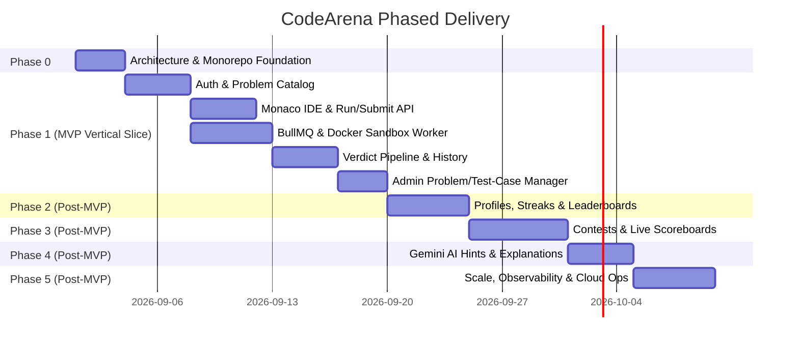

# CodeArena Product Roadmap & Implementation Strategy

This document outlines the phased development roadmap, MVP boundaries, testing strategy, and future scalability considerations for **CodeArena**.

---

## 1. MVP Scope vs. Post-MVP Evolution

To prevent overengineering and ensure rapid delivery of a working, production-grade foundation, the platform scope is divided into clear milestones:

### 1.1 MVP Definition (Milestone 1 — Core Vertical Slice)

The MVP delivers the complete, essential end-to-end flow:
**User → Problem → Monaco Editor → Run / Submit → BullMQ Queue → Judge Worker → Docker Sandbox → Real-Time Verdict → Submission History.**

#### Explicitly Included in MVP:

- **Authentication**: Email/Password registration, login, logout, and session cookies.
- **Problem Catalog**: Filterable/searchable problem list (Easy, Medium, Hard, tags).
- **Problem Workspace**: Problem statement, constraints, sample inputs, and Monaco code editor.
- **Languages**: Python 3.12, C++20, and TypeScript/JavaScript (Node.js 20).
- **Execution Engine**:
  - Run Code against sample / custom inputs.
  - Submit Code evaluated against hidden test cases.
  - Asynchronous BullMQ execution queue with Redis.
  - Judge Worker running untrusted code inside isolated Docker containers (cgroups v2 + seccomp + network isolation).
- **Verdicts**: Accepted (AC), Wrong Answer (WA), Time Limit Exceeded (TLE), Memory Limit Exceeded (MLE), Compilation Error (CE), Runtime Error (RE).
- **Submission Tracking**: User submission history with runtime, memory stats, and code viewer.
- **Admin Management**: Basic admin UI/APIs to create problems, edit statements, and manage test cases.

#### Explicitly Excluded from MVP (Deferred to Post-MVP):

- ❌ Cloudflare WAF / Nginx ingress configurations
- ❌ S3 / MinIO external blob storage (test cases stored in PostgreSQL for MVP)
- ❌ Contests, time-bound competition lobbies, and live ICPC scoreboards
- ❌ Gemini AI hints, explanations, and complexity breakdown
- ❌ Pre-warmed container pools & multi-region worker clusters
- ❌ Prometheus, Grafana, and complex telemetry infrastructure
- ❌ Additional languages (Java, Rust, Go)

---

## 2. Phase-by-Phase Implementation Roadmap

### Phase 0: Project Setup & Monorepo Foundation

- Initialize Turborepo with `pnpm` workspaces:
  - `apps/web` (Next.js App Router, Tailwind CSS)
  - `apps/judge-worker` (Node.js/TypeScript background worker)
  - `packages/db` (Prisma ORM, PostgreSQL connection)
  - `packages/judge-shared` (Shared DTOs, Enums, Verdict constants)
- Configure `docker-compose.yml` for local development (PostgreSQL, Redis).
- Setup standard CI workflows for linting, formatting, and TypeScript compilation.

### Phase 1: MVP Core (Problem Solving & Code Execution)

- **Database & Auth**:
  - Implement Prisma schema migrations for core models (`User`, `Session`, `Problem`, `TestCase`, `Submission`).
  - Session-based authentication endpoints and middleware.
- **Problem Catalog & Monaco IDE**:
  - Problem list with server-side pagination, search, and difficulty tags.
  - Split-pane problem solver page with Monaco Editor (syntax highlighting, theme selection, reset boilerplate).
- **Judge Worker Engine**:
  - BullMQ consumer listening to `code-execution` queue.
  - Docker sandbox runner enforcing memory, CPU, and network boundaries (`--net=none`, tmpfs).
  - Multi-language compilers/runners for Python, C++, and TypeScript.
- **Verdict Pipeline**:
  - Server-Sent Events (SSE) route streaming live test case results and final verdict back to user.
  - Store submission results and test case outcomes in database.
- **Admin Problem Creator**:
  - Problem creation and test case management UI for admins.

### Phase 2: User Engagement, History & Leaderboard (Post-MVP)

- User profile page with solved problem breakdowns.
- Submission heatmap and daily streak calculation.
- Global leaderboard ranked by rating and solved count (`Profile.globalRank` computed cache).

### Phase 3: Competitive Contests Engine (Post-MVP)

- Contest model supporting `UPCOMING`, `RUNNING`, and `FINISHED` statuses.
- Contest registration, timer countdown, and problem set locking.
- Live scoreboard with penalty minutes tracking.

### Phase 4: Gemini AI Tutoring Integration (Post-MVP)

- Progressive hints (Level 1: Concept, Level 2: Algorithm approach, Level 3: Pseudocode).
- "Explain My Bug" feature analyzing failed test case inputs and user code.
- Automatic time and space asymptotic complexity estimation.

### Phase 5: Production Operations & Hardening (Post-MVP)

- Multi-stage production container builds.
- Production hosting configuration (AWS ECS / Fly.io / Kubernetes).
- Observability via Prometheus metrics and structured logging.

---

## 3. Testing Strategy

### 3.1 Unit Testing (Vitest)

- Test case evaluation algorithms (Exact match, whitespace normalization).
- Language compiler command formatting and timeout bounds.

### 3.2 Integration Testing

- Authenticated API route tests for problem retrieval and submission ingestion.
- BullMQ worker tests verifying jobs are dequeued, processed, and persisted to database.
- SSE stream delivery verification.

### 3.3 Sandbox Security Testing (Introduced with Judge Sandbox)

- **Fork Bomb Test**: Verify `:(){ :|:& };:` is halted by `pids.max` without host degradation.
- **Network Egress Test**: Verify socket creation and network calls are blocked (`--net=none`).
- **Filesystem Tampering Test**: Verify write attempts to root fail on read-only mount.
- **Timeout Test**: Verify infinite loops terminate with `TIME_LIMIT_EXCEEDED` within limit + grace period.

### 3.4 End-to-End Testing (Playwright)

- User Journey: Register/Login -> Open Problem -> Write code in Monaco -> Run sample case -> Submit -> Receive Verdict -> View in Submission History.
