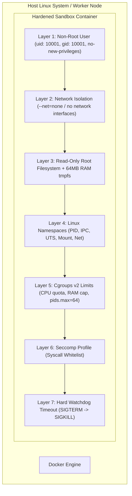

# CodeArena Security Model & Sandbox Hardening

This document defines the multi-layer security architecture, threat model, sandbox isolation specifications, and anti-abuse safeguards for **CodeArena**.

---

## 1. Threat Model & Attack Vectors

Online judges execute untrusted, arbitrary user-submitted source code. The security perimeter must protect against multiple attack vectors:

| Threat Vector                   | Attack Scenario                                                                                           | Impact                                                                     | Mitigation Strategy                                                                                                  |
| :------------------------------ | :-------------------------------------------------------------------------------------------------------- | :------------------------------------------------------------------------- | :------------------------------------------------------------------------------------------------------------------- |
| **Host System Compromise**      | Malicious code attempting to escape sandbox, read host `/etc/passwd`, access docker socket, or gain root. | Critical                                                                   | Linux namespaces, seccomp filters, unprivileged runner (`uid 10001`), read-only rootfs, `cap-drop=ALL`.              |
| **Denial of Service (DoS)**     | Fork bombs (`:(){ :                                                                                       | :& };:`), infinite loops, allocating gigabytes of RAM to trigger host OOM. | High                                                                                                                 | Cgroups v2 `pids.max=64`, `memory.max=256M`, `memory.swap.max=0`, and hard wall-time watchdogs. |
| **Network Exfiltration / SSRF** | Code attempting to ping internal network services or launch attacks.                                      | Critical                                                                   | Complete network isolation (`--net=none` / isolated network namespace).                                              |
| **Test Case Data Leakage**      | Code attempting to inspect filesystem, memory of previous runs, or brute-force hidden test inputs.        | High                                                                       | Ephemeral containers/tmpfs wiped per run; hidden test cases never exposed in API payloads or client bundles.         |
| **Disk Exhaustion**             | Code generating massive output files (`while(1) { printf("x"); }`).                                       | Medium                                                                     | Strict output file size limits (`ulimit -f` / `RLIMIT_FSIZE=10MB`), stdout buffer capping (64KB), tmpfs size limits. |
| **Platform Abuse & Spam**       | Scripted bots flooding submissions or auth endpoints.                                                     | Medium                                                                     | Redis sliding-window rate limiting per IP and authenticated user ID.                                                 |

---

## 2. Code Execution Sandbox Hardening (Defense-in-Depth)

Every code execution runs in an isolated, disposable sandbox enforcing seven layers of defense:

### 2.1 Cgroups v2 Resource Constraints

Resource limits are strictly enforced at the container/kernel level:

- **CPU Quota**: `cpu.max="100000 100000"` (exact 1 CPU core allocation).
- **Memory Limit**: `memory.max="268435456"` (256 MB hard cap).
- **Swap Disabled**: `memory.swap.max="0"` (prevents disk-swapping bypasses).
- **PID Limit**: `pids.max="64"` (immediately neutralizes fork bombs).
- **RLIMIT_NOFILE**: Max file descriptors capped at 64.
- **RLIMIT_FSIZE**: Max output file creation capped at 10 MB.

### 2.2 Seccomp (Secure Computing Mode) Syscall Filtering

A strict custom seccomp profile is passed to the container runtime:

- **Explicitly Blocked Syscalls**:
  - `socket`, `bind`, `connect`, `listen`, `accept`, `sendto`, `recvfrom` (All networking)
  - `ptrace`, `process_vm_readv`, `process_vm_writev` (Process inspection)
  - `chroot`, `pivot_root`, `mount`, `umount2` (Filesystem tampering)
  - `reboot`, `syslog`, `kexec_load`, `settimeofday` (System operations)
  - `keyctl`, `add_key`, `request_key` (Kernel keyrings)

### 2.3 Ephemeral Filesystem & Isolation

- Root filesystem is mounted strictly **Read-Only** (`--read-only`).
- Only `/tmp` is writable, backed by an in-memory **tmpfs** limited to 64 MB (`--tmpfs /tmp:rw,noexec,nosuid,size=64m`).
- All Linux capabilities are dropped (`--cap-drop=ALL`).
- Privileges cannot be escalated (`--security-opt=no-new-privileges:true`).

---

## 3. Web & Application Security

### 3.1 Authentication & Session Management

- **Password Security**: Passwords hashed using standard secure hashing (Argon2id or bcrypt).
- **Session Tokens**: Cryptographically random 256-bit entropy tokens stored in database with an absolute 14-day expiry.
- **Cookie Security**: `HttpOnly`, `Secure` (in production), `SameSite=Lax`, `Path=/`.
- **Role-Based Access Control (RBAC)**:
  - `USER`: Browse, submit code, view own history.
  - `ADMIN`: Manage problems, edit statements, and configure test cases.

### 3.2 Test Case Confidentiality & Integrity

- Hidden test cases (`isHidden: true`) are never returned in public API payloads.
- For failed hidden test cases, users receive only the case index, verdict, execution time, and memory usage.

---

## 4. Sandbox Testing Cadence

- Security and sandbox validation tests (fork bomb resistance, network isolation, memory limit enforcement, and timeout handling) are introduced and verified when the Docker sandbox worker is implemented, ensuring security is built-in from day one without blocking initial project scaffolding.
